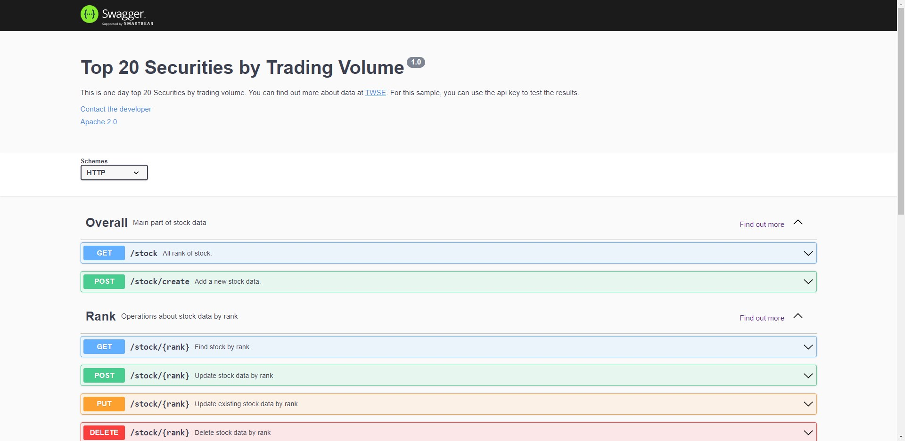

## OpenAPI Built From Swagger

### Basic Structure

The basic structure of the definitions in YAML, and a sample OpenAPI 2.0 definition written in YAML looks like:

### Description

This document is about top 20 stock by tading volume from [TWSE](https://www.twse.com.tw/zh/page/trading/exchange/MI_INDEX20.html).

### Methods

- GET
- POST
- PUT
- DELETE

### Paths

The paths section defines endpoints, and HTTP methods by these endpoints.

For example:

- You can GET all results `(/stock)` or post data `(/stock/create)`.

### Parameters

Operations can be passed via URL path `(/stock{rank})`, `(/stock/{stockCode})`.

### Model

- Demo
- Stock, EachStock
- Rank
- StockCode
- StockName

### Creator

**Timothy**

- https://github.com/Coli-co
- awestlifeblue@gmail.com
